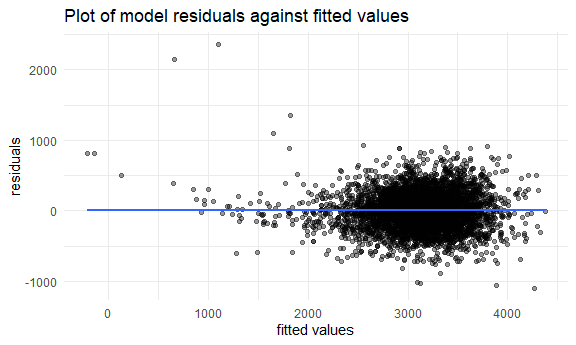
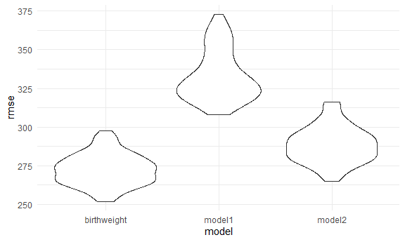

Homework 6
================
Riya Bhilegaonkar
2022-11-27

### Problem 1

### Problem 2

Creating a `city_state` variable and a binary variable `resolved` to
indicate whether a homicide is solved. Filtering for cities that do not
include Dallas(TX), Phoenix(AZ), Kansas City(MO) and Tulsa(AL) and
filtering for the victim race of white or black. The `victim_age`
variable is changed to a numeric variable.

``` r
homicide_data = read_csv("data/homicide-data.csv") %>%
  janitor::clean_names() %>%
  mutate(city_state = str_c(city,    state, sep=", "), resolved = as.numeric(disposition == "Closed by arrest"))%>%
  filter(city_state !="Dallas, TX" | city_state !="Phoenix, AZ" | city_state!="Kansas City, MO" | city_state != "Tulsa, AL", victim_race == "White" | victim_race == "Black") %>%
  mutate(victim_age = as.numeric(victim_age), victim_race = fct_relevel(victim_race, "White"))%>%
  select(city_state, victim_sex, resolved, victim_age, victim_race)
```

    ## Rows: 52179 Columns: 12
    ## ── Column specification ────────────────────────────────────────────────────────
    ## Delimiter: ","
    ## chr (9): uid, victim_last, victim_first, victim_race, victim_age, victim_sex...
    ## dbl (3): reported_date, lat, lon
    ## 
    ## ℹ Use `spec()` to retrieve the full column specification for this data.
    ## ℹ Specify the column types or set `show_col_types = FALSE` to quiet this message.

For the city of Baltimore, MD we use the `glm` function to fit a
logistic regression with resolved vs unsolved as the outcome and victim
age, sex and race as predictors, saving the results as an R object.

``` r
fit_logistic = homicide_data %>%
  filter(city_state == "Baltimore, MD")%>%
  glm(resolved ~ victim_age + victim_race + victim_sex, data =., family = binomial()) 
```

Displaying the estimate and the confidence interval of the adjusted odds
ratio for solving homicides comparing male victims to female victims
keeping all other variables fixed.

``` r
fit_logistic %>% 
  broom::tidy() %>% 
  mutate(OR = exp(estimate)) %>% # figure out CI calculations for OR??%>%
   filter(term=="victim_sexMale")%>%
  mutate(CI.low = OR - std.error*1.96, CI.high = OR + std.error*1.96)%>%
  select(term, log_OR = estimate, OR, CI.low, CI.high) %>% 
  knitr::kable(digits = 3)
```

| term           | log_OR |    OR | CI.low | CI.high |
|:---------------|-------:|------:|-------:|--------:|
| victim_sexMale | -0.854 | 0.426 |  0.155 |   0.696 |

Running a `glm` for each city in the dataset and extracting the adjusted
odds ratio and CI for solving homicides comparing male victims to female
victims. Creating a dataframe with estimated ORs and CIs for each city:

``` r
# fix this entirely
homicide_data %>%
  nest(data=-city_state)%>%
  mutate(
    models = map(data, ~glm(resolved ~ victim_race + victim_sex + victim_age, data=homicide_data, family = binomial()), na.action="na.omit"),
    results = map(models, broom::tidy)) %>%
  select(-data, -models)%>%
  unnest(results)%>%
mutate(OR = exp(estimate)) %>% # figure out CI calculations for OR??
    filter(term=="victim_sexMale")%>%
  mutate(CI.low = OR - std.error*1.96, CI.high = OR + std.error*1.96)%>%
  select(city_state, term, log_OR = estimate, OR, CI.low, CI.high) %>% 
  knitr::kable(digits = 3)
```

| city_state         | term           | log_OR |    OR | CI.low | CI.high |
|:-------------------|:---------------|-------:|------:|-------:|--------:|
| Albuquerque, NM    | victim_sexMale | -0.506 | 0.603 |  0.545 |   0.661 |
| Atlanta, GA        | victim_sexMale | -0.506 | 0.603 |  0.545 |   0.661 |
| Baltimore, MD      | victim_sexMale | -0.506 | 0.603 |  0.545 |   0.661 |
| Baton Rouge, LA    | victim_sexMale | -0.506 | 0.603 |  0.545 |   0.661 |
| Birmingham, AL     | victim_sexMale | -0.506 | 0.603 |  0.545 |   0.661 |
| Boston, MA         | victim_sexMale | -0.506 | 0.603 |  0.545 |   0.661 |
| Buffalo, NY        | victim_sexMale | -0.506 | 0.603 |  0.545 |   0.661 |
| Charlotte, NC      | victim_sexMale | -0.506 | 0.603 |  0.545 |   0.661 |
| Chicago, IL        | victim_sexMale | -0.506 | 0.603 |  0.545 |   0.661 |
| Cincinnati, OH     | victim_sexMale | -0.506 | 0.603 |  0.545 |   0.661 |
| Columbus, OH       | victim_sexMale | -0.506 | 0.603 |  0.545 |   0.661 |
| Denver, CO         | victim_sexMale | -0.506 | 0.603 |  0.545 |   0.661 |
| Detroit, MI        | victim_sexMale | -0.506 | 0.603 |  0.545 |   0.661 |
| Durham, NC         | victim_sexMale | -0.506 | 0.603 |  0.545 |   0.661 |
| Fort Worth, TX     | victim_sexMale | -0.506 | 0.603 |  0.545 |   0.661 |
| Fresno, CA         | victim_sexMale | -0.506 | 0.603 |  0.545 |   0.661 |
| Houston, TX        | victim_sexMale | -0.506 | 0.603 |  0.545 |   0.661 |
| Indianapolis, IN   | victim_sexMale | -0.506 | 0.603 |  0.545 |   0.661 |
| Jacksonville, FL   | victim_sexMale | -0.506 | 0.603 |  0.545 |   0.661 |
| Las Vegas, NV      | victim_sexMale | -0.506 | 0.603 |  0.545 |   0.661 |
| Long Beach, CA     | victim_sexMale | -0.506 | 0.603 |  0.545 |   0.661 |
| Los Angeles, CA    | victim_sexMale | -0.506 | 0.603 |  0.545 |   0.661 |
| Louisville, KY     | victim_sexMale | -0.506 | 0.603 |  0.545 |   0.661 |
| Memphis, TN        | victim_sexMale | -0.506 | 0.603 |  0.545 |   0.661 |
| Miami, FL          | victim_sexMale | -0.506 | 0.603 |  0.545 |   0.661 |
| Milwaukee, wI      | victim_sexMale | -0.506 | 0.603 |  0.545 |   0.661 |
| Minneapolis, MN    | victim_sexMale | -0.506 | 0.603 |  0.545 |   0.661 |
| Nashville, TN      | victim_sexMale | -0.506 | 0.603 |  0.545 |   0.661 |
| New Orleans, LA    | victim_sexMale | -0.506 | 0.603 |  0.545 |   0.661 |
| New York, NY       | victim_sexMale | -0.506 | 0.603 |  0.545 |   0.661 |
| Oakland, CA        | victim_sexMale | -0.506 | 0.603 |  0.545 |   0.661 |
| Oklahoma City, OK  | victim_sexMale | -0.506 | 0.603 |  0.545 |   0.661 |
| Omaha, NE          | victim_sexMale | -0.506 | 0.603 |  0.545 |   0.661 |
| Philadelphia, PA   | victim_sexMale | -0.506 | 0.603 |  0.545 |   0.661 |
| Pittsburgh, PA     | victim_sexMale | -0.506 | 0.603 |  0.545 |   0.661 |
| Richmond, VA       | victim_sexMale | -0.506 | 0.603 |  0.545 |   0.661 |
| San Antonio, TX    | victim_sexMale | -0.506 | 0.603 |  0.545 |   0.661 |
| Sacramento, CA     | victim_sexMale | -0.506 | 0.603 |  0.545 |   0.661 |
| Savannah, GA       | victim_sexMale | -0.506 | 0.603 |  0.545 |   0.661 |
| San Bernardino, CA | victim_sexMale | -0.506 | 0.603 |  0.545 |   0.661 |
| San Diego, CA      | victim_sexMale | -0.506 | 0.603 |  0.545 |   0.661 |
| San Francisco, CA  | victim_sexMale | -0.506 | 0.603 |  0.545 |   0.661 |
| St. Louis, MO      | victim_sexMale | -0.506 | 0.603 |  0.545 |   0.661 |
| Stockton, CA       | victim_sexMale | -0.506 | 0.603 |  0.545 |   0.661 |
| Tampa, FL          | victim_sexMale | -0.506 | 0.603 |  0.545 |   0.661 |
| Tulsa, OK          | victim_sexMale | -0.506 | 0.603 |  0.545 |   0.661 |
| Tulsa, AL          | victim_sexMale | -0.506 | 0.603 |  0.545 |   0.661 |
| Washington, DC     | victim_sexMale | -0.506 | 0.603 |  0.545 |   0.661 |

### Problem 3

Loading and cleaning the data for regression analysis:

``` r
birthweight = 
   read_csv("./data/birthweight.csv") %>%
  janitor::clean_names()%>%
  mutate(babysex = recode(
    babysex,
    "1" = "male",
    "2" = "female"
  ),
  frace = recode(
    frace,
    "1" = "White",
    "2" = "Black",
    "3" = "Asian",
    "4" = "Puerto Rican",
    "8" = "Other",
    "9" = "Unknown"
  ),
  malform = recode(
    malform,
    "0" = "absent",
    "1" = "present"
  ),
  mrace = recode(
    mrace,
    "1" = "White",
    "2" = "Black",
    "3" = "Asian",
    "4" = "Puerto Rican",
    "8" = "Other"
  )
  )
```

    ## Rows: 4342 Columns: 20
    ## ── Column specification ────────────────────────────────────────────────────────
    ## Delimiter: ","
    ## dbl (20): babysex, bhead, blength, bwt, delwt, fincome, frace, gaweeks, malf...
    ## 
    ## ℹ Use `spec()` to retrieve the full column specification for this data.
    ## ℹ Specify the column types or set `show_col_types = FALSE` to quiet this message.

The birthweight dataset contains information that allows us to
understand the effects of several variable such as a baby’s sex, head
circumference at birth, length at birth, birth weight, mother’s weight
at delivery, family monthly income etc on a child’s birthweight. We
first clean the data using `janitor::clean_names()`. For the purpose of
our regression analysis, we convert the variables of `babysex`,
frace`,`malform`, and`mrace\` to factor variables. They are present in
the intial dataset as categorical variables and their numeric coded
values are not as intuitive to analysis as the recoded factor variables
would be.

Checking for missing values:

``` r
birthweight%>%
  summarise(N_A = sum(is.na(birthweight)))
```

    ## # A tibble: 1 × 1
    ##     N_A
    ##   <int>
    ## 1     0

From the tibble we see that there appears to be no missing values in the
data.

We will use stepwise regression to determine an ideal regression model
for birthweight:

``` r
all_lm <- lm(bwt~., data=birthweight)

backward <- step(all_lm, direction='backward', scope=formula(all_lm), trace=0)

summary(backward)
```

    ## 
    ## Call:
    ## lm(formula = bwt ~ babysex + bhead + blength + delwt + fincome + 
    ##     gaweeks + mheight + mrace + parity + ppwt + smoken, data = birthweight)
    ## 
    ## Residuals:
    ##      Min       1Q   Median       3Q      Max 
    ## -1097.18  -185.52    -3.39   174.14  2353.44 
    ## 
    ## Coefficients:
    ##                     Estimate Std. Error t value Pr(>|t|)    
    ## (Intercept)       -6145.1507   141.9496 -43.291  < 2e-16 ***
    ## babysexmale         -28.5580     8.4549  -3.378 0.000737 ***
    ## bhead               130.7770     3.4466  37.944  < 2e-16 ***
    ## blength              74.9471     2.0190  37.120  < 2e-16 ***
    ## delwt                 4.1067     0.3921  10.475  < 2e-16 ***
    ## fincome               0.3180     0.1747   1.820 0.068844 .  
    ## gaweeks              11.5925     1.4621   7.929 2.79e-15 ***
    ## mheight               6.5940     1.7849   3.694 0.000223 ***
    ## mraceBlack          -63.9057    42.3663  -1.508 0.131523    
    ## mracePuerto Rican   -25.7914    45.3502  -0.569 0.569578    
    ## mraceWhite           74.8868    42.3146   1.770 0.076837 .  
    ## parity               96.3047    40.3362   2.388 0.017004 *  
    ## ppwt                 -2.6756     0.4274  -6.261 4.20e-10 ***
    ## smoken               -4.8434     0.5856  -8.271  < 2e-16 ***
    ## ---
    ## Signif. codes:  0 '***' 0.001 '**' 0.01 '*' 0.05 '.' 0.1 ' ' 1
    ## 
    ## Residual standard error: 272.3 on 4328 degrees of freedom
    ## Multiple R-squared:  0.7181, Adjusted R-squared:  0.7173 
    ## F-statistic: 848.1 on 13 and 4328 DF,  p-value: < 2.2e-16

Steps of Modelling process: In order to chose the variables for our
model, we use the stepwise approach which compares successive models and
identifies the best subsets. For my model I used backward elimination.
For this I first started with all the predictions in the model and then
removed the predictors with the highest p-value (p-value) (those which
are not significant \<0.05). The `step()` with the direction of
‘backward’ function performs this analysis as it continues to re-fit the
model and remove the next least significant predictor. The end results
of the `step()`, the summary for the anova, shows which variables need
to be removed from the model.

``` r
backward[["anova"]]
```

    ##         Step Df   Deviance Resid. Df Resid. Dev      AIC
    ## 1            NA         NA      4320  320724338 48717.83
    ## 2   - wtgain  0      0.000      4320  320724338 48717.83
    ## 3  - pnumsga  0      0.000      4320  320724338 48717.83
    ## 4  - pnumlbw  0      0.000      4320  320724338 48717.83
    ## 5    - frace  4 124365.432      4324  320848704 48711.51
    ## 6  - malform  1   1447.241      4325  320850151 48709.53
    ## 7    - ppbmi  1   6928.376      4326  320857079 48707.63
    ## 8   - momage  1  29211.120      4327  320886290 48706.02
    ## 9 - menarche  1 100121.331      4328  320986412 48705.38

``` r
backward %>% anova
```

    ## Analysis of Variance Table
    ## 
    ## Response: bwt
    ##             Df    Sum Sq   Mean Sq   F value    Pr(>F)    
    ## babysex      1   8547634   8547634  115.2515 < 2.2e-16 ***
    ## bhead        1 628838120 628838120 8478.8991 < 2.2e-16 ***
    ## blength      1 140213755 140213755 1890.5633 < 2.2e-16 ***
    ## delwt        1   8647158   8647158  116.5934 < 2.2e-16 ***
    ## fincome      1   4845845   4845845   65.3386 8.111e-16 ***
    ## gaweeks      1   5936110   5936110   80.0392 < 2.2e-16 ***
    ## mheight      1    883287    883287   11.9097 0.0005638 ***
    ## mrace        3  11463486   3821162   51.5224 < 2.2e-16 ***
    ## parity       1    481225    481225    6.4886 0.0108914 *  
    ## ppwt         1   2735314   2735314   36.8814 1.363e-09 ***
    ## smoken       1   5073849   5073849   68.4129 < 2.2e-16 ***
    ## Residuals 4328 320986412     74165                        
    ## ---
    ## Signif. codes:  0 '***' 0.001 '**' 0.01 '*' 0.05 '.' 0.1 ' ' 1

From these results we see that the variables of `wtgain`, `pnumsga`,
`pnumlbw`, `frace`, `malform`, `ppbmi`, `momage`, and `menarche` can be
removed from our model. Looking at the p-values we see that `babysex`,
`bhead`, `blength`, `delwt`, `fincome`, `gaweeks`, `mheight`, `mrace`,
`parity`, `ppwt` and `smoken` are significant at an alpha = 0.05
significance level and we will include these predictors in our model.

Using stepwise backward the chosen model is regression model is, this
will be my proposed regression model:

``` r
birthweight_lm <- lm(bwt~babysex + bhead + blength + delwt + fincome + gaweeks + mheight + mrace + parity + ppwt + smoken, data=birthweight)

summary(birthweight_lm)
```

    ## 
    ## Call:
    ## lm(formula = bwt ~ babysex + bhead + blength + delwt + fincome + 
    ##     gaweeks + mheight + mrace + parity + ppwt + smoken, data = birthweight)
    ## 
    ## Residuals:
    ##      Min       1Q   Median       3Q      Max 
    ## -1097.18  -185.52    -3.39   174.14  2353.44 
    ## 
    ## Coefficients:
    ##                     Estimate Std. Error t value Pr(>|t|)    
    ## (Intercept)       -6145.1507   141.9496 -43.291  < 2e-16 ***
    ## babysexmale         -28.5580     8.4549  -3.378 0.000737 ***
    ## bhead               130.7770     3.4466  37.944  < 2e-16 ***
    ## blength              74.9471     2.0190  37.120  < 2e-16 ***
    ## delwt                 4.1067     0.3921  10.475  < 2e-16 ***
    ## fincome               0.3180     0.1747   1.820 0.068844 .  
    ## gaweeks              11.5925     1.4621   7.929 2.79e-15 ***
    ## mheight               6.5940     1.7849   3.694 0.000223 ***
    ## mraceBlack          -63.9057    42.3663  -1.508 0.131523    
    ## mracePuerto Rican   -25.7914    45.3502  -0.569 0.569578    
    ## mraceWhite           74.8868    42.3146   1.770 0.076837 .  
    ## parity               96.3047    40.3362   2.388 0.017004 *  
    ## ppwt                 -2.6756     0.4274  -6.261 4.20e-10 ***
    ## smoken               -4.8434     0.5856  -8.271  < 2e-16 ***
    ## ---
    ## Signif. codes:  0 '***' 0.001 '**' 0.01 '*' 0.05 '.' 0.1 ' ' 1
    ## 
    ## Residual standard error: 272.3 on 4328 degrees of freedom
    ## Multiple R-squared:  0.7181, Adjusted R-squared:  0.7173 
    ## F-statistic: 848.1 on 13 and 4328 DF,  p-value: < 2.2e-16

Here we can see summary statistics about the model including AIC and BIC
values:

``` r
birthweight_lm %>%
  broom::glance()%>%
  knitr::kable()
```

| r.squared | adj.r.squared |    sigma | statistic | p.value |  df |    logLik |      AIC |      BIC |  deviance | df.residual | nobs |
|----------:|--------------:|---------:|----------:|--------:|----:|----------:|---------:|---------:|----------:|------------:|-----:|
| 0.7180997 |     0.7172529 | 272.3326 |  848.0727 |       0 |  13 | -30499.72 | 61029.44 | 61125.08 | 320986412 |        4328 | 4342 |

Plot of model residuals against fitted values:

``` r
birthweight %>% 
modelr::add_residuals(birthweight_lm) %>%
modelr::add_predictions(birthweight_lm) %>% 
  ggplot(aes(x = pred, 
             y = resid)) +
  geom_point(alpha=0.4) +
  geom_smooth(method = "lm",
              se = FALSE) +
  labs(
    x = "fitted values",
    y = "residuals",
    title = "Plot of model residuals against fitted values")
```

    ## `geom_smooth()` using formula 'y ~ x'



Comparing the proposed regression model against two others:

1)  One using length at birth and gestational age as predictors (main
    effects only)

``` r
model1 = lm(bwt ~ blength + gaweeks, data=birthweight)
```

2)  One using head circumference, length, sex, and all interactions
    (including the three-way interaction) between these

``` r
model2 = lm(bwt ~ bhead + blength + babysex + bhead*blength + bhead*babysex + blength*babysex + bhead*blength*blength, data=birthweight)
```

Using cross-validated prediction errors to make the comparison:

``` r
cv_df =
  modelr::crossv_mc(birthweight, 100) %>% 
  mutate(
    train = map(train, as_tibble),
    test = map(test, as_tibble))
```

``` r
cv_df = 
  cv_df %>% 
  mutate(
    birthweight_lm  = map(train, ~lm(bwt~babysex + bhead + blength + delwt + fincome + gaweeks + mheight + mrace + parity + ppwt + smoken, data=.x)),
    model1    = map(train, ~lm(bwt ~ blength + gaweeks, data=.x)),
    model2  = map(train, ~lm(bwt ~ bhead + blength + babysex + bhead*blength + bhead*babysex + blength*babysex + bhead*blength*blength, data=.x))) %>% 
  mutate(
    rmse_birthweight = map2_dbl(birthweight_lm, test, ~modelr::rmse(model = .x, data = .y)),
    rmse_model1    = map2_dbl(model1, test, ~modelr::rmse(model = .x, data = .y)),
    rmse_model2 = map2_dbl(model2, test, ~modelr::rmse(model = .x, data = .y)))
```

``` r
cv_df %>% 
  select(starts_with("rmse")) %>% 
  pivot_longer(
    everything(),
    names_to = "model", 
    values_to = "rmse",
    names_prefix = "rmse_") %>%
  mutate(model = fct_inorder(model)) %>% 
  ggplot(aes(x = model, y = rmse)) + geom_violin()
```



From these results there is clearly an improvement in predictive
accuracy gained through my proposed regression model in comparison to
model 1 and model 2, as my model produces the lowest cross validated
prediction error. In terms of ranking from lowest to highest prediction
error it would first be my model, then model 2, then model 1.
